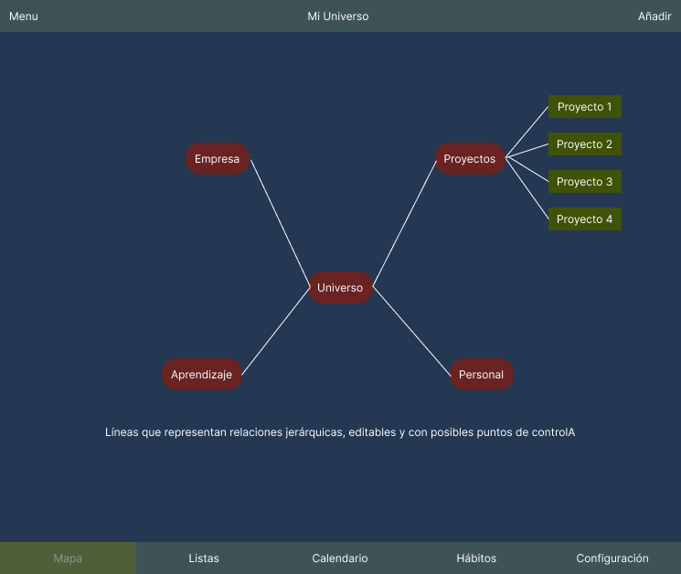

## Esta imagen busca capturar la esencia de un mapa mental interactivo y visualmente organizado, listo para que el usuario navegue y manipule sus "Áreas de Enfoque".

# Descripción de los elementos:

 ## Encabezado Superior: Contiene el título de la aplicación/vista ("Mi Universo de Tareas") y botones para acciones globales como un menú lateral (si aplica) y el botón para añadir nuevas áreas (+ Añadir).

## Lienzo Interactivo: Esta es el área central donde el usuario ve y manipula el mapa mental. Es un área grande y desplazable.

* Nodo Central ("Mi Universo"): Un nodo distintivo en el centro, que sirve como la raíz de todo el mapa.
* Nodos de "Área de Enfoque": Representados como rectángulos o burbujas, conectados al nodo central o a un padre. Tienen un * Nombre visible, una Descripción (implícita o al interactuar), y un Color distintivo que ayuda a la organización visual.
* Nodos de "Sub-Área de Enfoque": Similares a los nodos de áreas, pero ramificándose de un área principal, mostrando la jerarquía.
* Líneas de Conexión: Representan la relación padre-hijo. Se entienden como editables (podrían tener puntos de control no visibles para la generación de la imagen, pero implícitos en el modelo conceptual) y son fundamentales para la organización visual.

# Barra de Navegación Inferior: 
Permite al usuario cambiar rápidamente entre las vistas principales de la aplicación: 
* "Mapa" 
* "Listas" 
* "Calendario"
* "Hábitos"
* "Configuración" (posiblemente). 
El icono de la vista actual (Mapa) estaría resaltado.